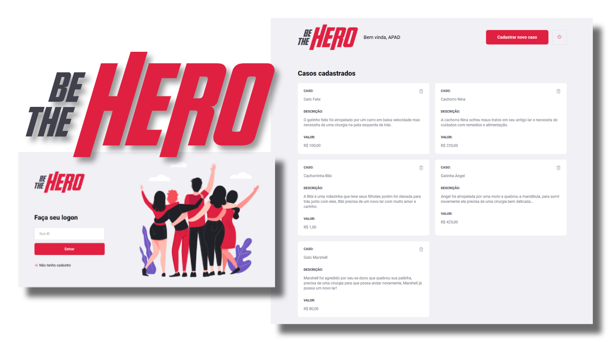
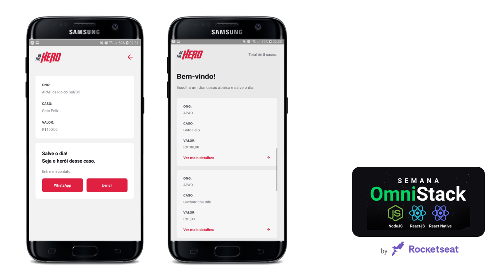

# Be The Hero - Embrace a cause!

> A different way to connect NGOs (Non-Governmental Organizations) that need help, with people who want to help with .

- Create an NGO profile and connect people with your causes
- Create incidents and ask for help with the expenses
- Available in web and mobile app

## Built With

- Backend: Node.js
  - Knex for SQLite
  - Express for routes
  - Celebrate for validation
  - Cross-env for environment variables
  - Jest and Supertest for tests

- Frontend: React
  - Axios for HTTP requests
  - React packages: react-dom, react-router-dom, react-icons

- Mobile: React Native
  - Expo for mobile native resources
  - Axios for HTTP requests
  - Intl for formatting
  - Expo-mail-composer for email

## For improvements
  
  - Create validation for every request in backend
  - Develop more tests in backend
  - Fix scroll for small screens in mobile version
  - Validate inputs in frontend and mobile

## 👤 Author 

- Github: [@flpfar](https://github.com/flpfar)
- Twitter: [@flpfar](https://twitter.com/flpfar)
- Linkedin: [Felipe Augusto Rosa](https://www.linkedin.com/in/felipe-augusto-rosa-7b96a4b1)

## 🤝 Contributing

Contributions, issues and feature requests are welcome!

Feel free to check the [issues page](issues/).

## Show your support

Give a ⭐️ if you like this project!

## Acknowledgments

- This project was created following instructions from [RocketSeat]{https://rocketseat.com.br/} as part of the Omnistack Week 11th edition.
